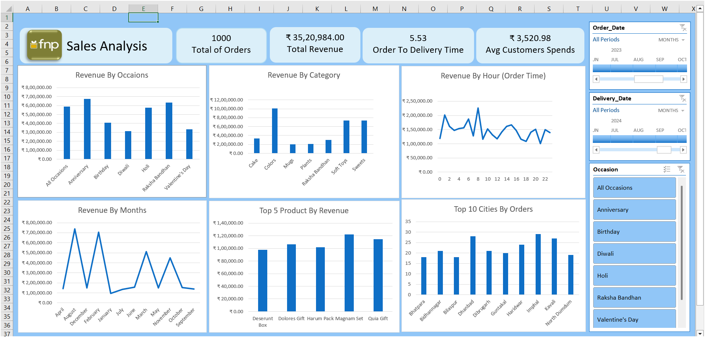

<div align="center">

# 📊 Excel FNP Sales Analysis Dashboard


<br>


</div>

---

# 📌 Project Overview

This project analyzes **Ferns N Petals (FNP)** sales data using **Microsoft Excel** and develops an interactive dashboard to monitor business performance, customer behavior, and revenue trends.

The dashboard converts raw data into meaningful business insights through data visualization and interactive reporting techniques.

---

# 🎯 Project Objectives

✅ Analyze overall sales performance.

✅ Identify top-performing products and categories.

✅ Understand customer purchasing behavior.

✅ Analyze revenue trends across occasions and cities.

✅ Build an interactive business dashboard for decision-making.

---

# 🛠️ Tools & Technologies Used

| Tool | Purpose |
|------|----------|
| Microsoft Excel | Data Analysis |
| Pivot Tables | Data Aggregation |
| Pivot Charts | Data Visualization |
| Slicers | Interactive Filtering |
| Conditional Formatting | KPI Highlighting |
| Dashboard Design | Business Intelligence |

---

# 📂 Dataset Information

The dataset contains:

- Customer Information
- Order Details
- Product Categories
- Revenue Information
- Order & Delivery Dates
- Cities
- Occasions
- Payment Methods

---

# 📊 Dashboard Preview

<div align="center">



</div>

---

# 📈 Key Performance Indicators (KPIs)

| KPI | Value |
|-----|--------|
| Total Orders | 1000 |
| Total Revenue | ₹35,20,984 |
| Avg Customer Spend | ₹3,520 |
| Order to Delivery Time | 5.53 Days |

---

# 🔍 Key Business Insights

### 💰 Revenue Analysis
- Anniversary and Others occasions generated the highest revenue.
- Revenue shows strong seasonal trends.

### 📦 Product Analysis
- Flowers category contributed the highest sales.
- Certain products require better marketing strategies.

### 🏙️ City Analysis
- Mumbai generated the highest revenue.
- Major metropolitan cities contributed significantly to total sales.

### 💳 Payment Analysis
- Cash on Delivery was the most preferred payment method.

---

# 🚀 Dashboard Features

✅ Interactive Dashboard

✅ Dynamic Filters & Slicers

✅ KPI Cards

✅ Revenue Trend Analysis

✅ Category Analysis

✅ Customer Insights

✅ Business Performance Monitoring

---

# 📁 Project Structure

```text
Excel_FNP_Sales_Analysis_Project/
│
├── FnP_Analysis.xlsx
├── FnPAnalysis_DashBord.png
├── Resource/
├── fnp datasets/
└── README.md
```

---

# 💡 Business Use Cases

📌 Sales Performance Monitoring

📌 Revenue Growth Analysis

📌 Business Decision Support

📌 Customer Behavior Analysis

📌 Marketing Campaign Analysis

📌 Product Performance Tracking

---

# 📚 Skills Demonstrated

✔ Data Cleaning

✔ Data Visualization

✔ Dashboard Development

✔ Business Intelligence

✔ Data Storytelling

✔ Excel Functions

✔ Pivot Tables

✔ Analytical Thinking

---

# 📊 Dashboard Components

- Revenue by Occasion
- Revenue by Category
- Revenue by Hour
- Revenue by Status
- Revenue by Payment Method
- Top Cities by Revenue
- Interactive Date Filters

---

# 🏆 Project Outcome

Successfully developed a professional Excel dashboard that transforms raw sales data into actionable insights and supports strategic business decisions.

---

# 👨‍💻 Author

### Narendra Vispute

📍 Indore, India

💼 Aspiring Data Analyst | Data Science Enthusiast

🔗 GitHub: https://github.com/TechNarendra25

🔗 LinkedIn: Add Your LinkedIn Profile

---

<div align="center">

### ⭐ If you found this project useful, please give it a Star ⭐


</div>
